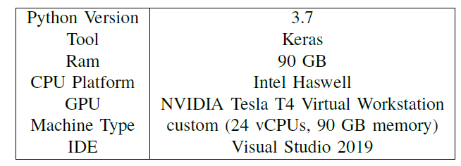
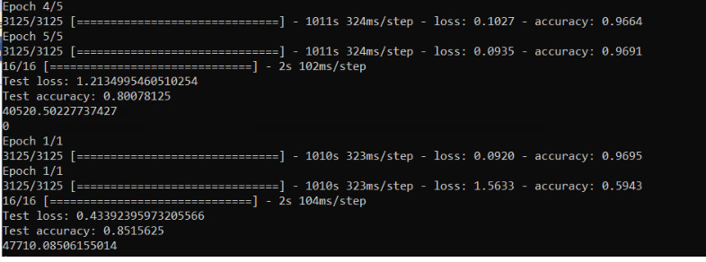
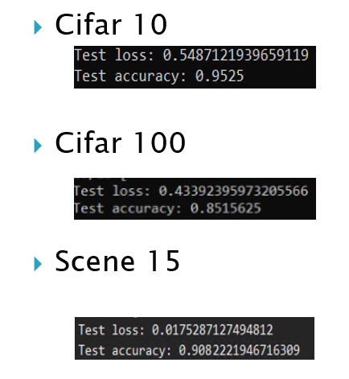
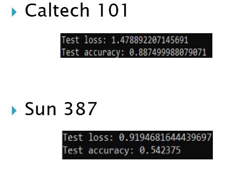

# VGG_CIFAR100 85% Accuracy
Using VGG16 Architecture for Recomputation of the dense layers for performance improvement of DCNN in CIFAR100 Dataset

This Project is Based on the Paper by Yimin Yang Professor at Lakehead University 
The Link to the Original IEEE Paper https://ieeexplore.ieee.org/abstract/document/8718406

The Same method can be inplemented on differnet datasets such as Scene-15, CALTECH-101, CALTECH-256, CIFAR-10, CIFAR-100, and SUN-397
# <h4>This Project was run on Google Cloud with these configurations 

The proposed method uses Moore-Penrose Inverse to extract the current residual error to each FC layer, which helps in generating well-generalized features. Further, the weights of each FC layers are recomputed according to the Moore-Penrose Inverse

According to the paper, the Moore-Penrose Inverse strategy is used to pull back the current residual error e of the DCNN network to each fully connected (FC) layer one at a time, which then generated the desired output P for those each fully connected layers. We are using the same strategy to recalculate the weights of each FC layer by using the desired output P which we obtained before and the input features. This method does not change any structure of the DCNN network but only recalculates the weights in the fully connected layers,which can be used to any/all existing DCNN models

While processing Larger data sets, memory management is an issue, to tackle this problem Image Data Generator can be used. Image Data Generator is a class under image preprocessing in Keras. It uses real-time data augmentation to generate batches of tensor images.The drawback of using image data generator comes into
the picture as the data cannot be explicitly manipulated. The images which are taken batch-wise are random and the flow of image generation cannot be controlled. This issue can be addressed by building a custom image data generator

Custom Image Data generator is a variation of image data generator where the data can be monitored. When dealing with a large dataset, a custom image data generator is effective where the weights and biases of the data have to be stored and updated batch-wise, as mentioned above Image Data generator cannot handle these issues because the data is generated in random batches

We achieved an accuracy of 85.1% for CIFAR100 which is one of the worlds Top 10 accuracy and we are really proud of it. Our method is significantly better than the original proposed MATLAB version which reached an accuracy of 80% using VGG16 model

The accuracy on differnt Datasets

Though the algorithm is able to achieve a non-iterative learning solution, it suffers from batch-learning. The algorithm proposed uses a batch learning solution which amounts to a high requirement of memory. The work we did was to find a method that could be used to improve the method from batch-learning to the Online Sequential learning algorithm.

For Full detailed explanation of the method, Implementation and algorithm you can contact me at msgun.mohan@gmail.com
